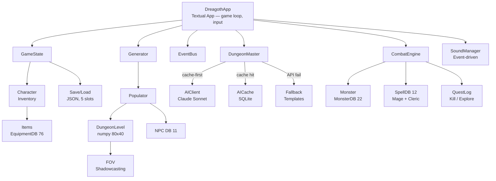
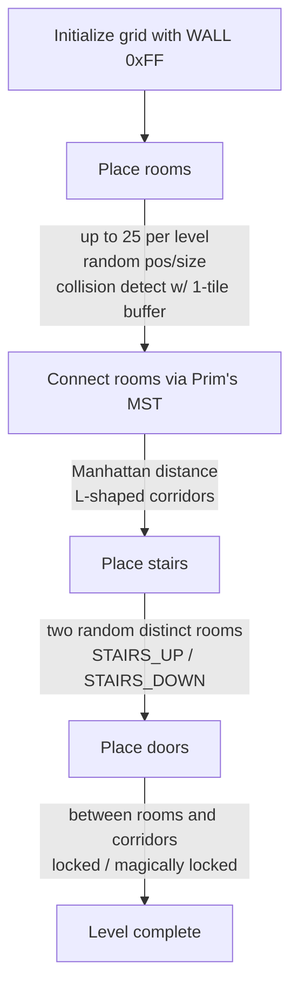
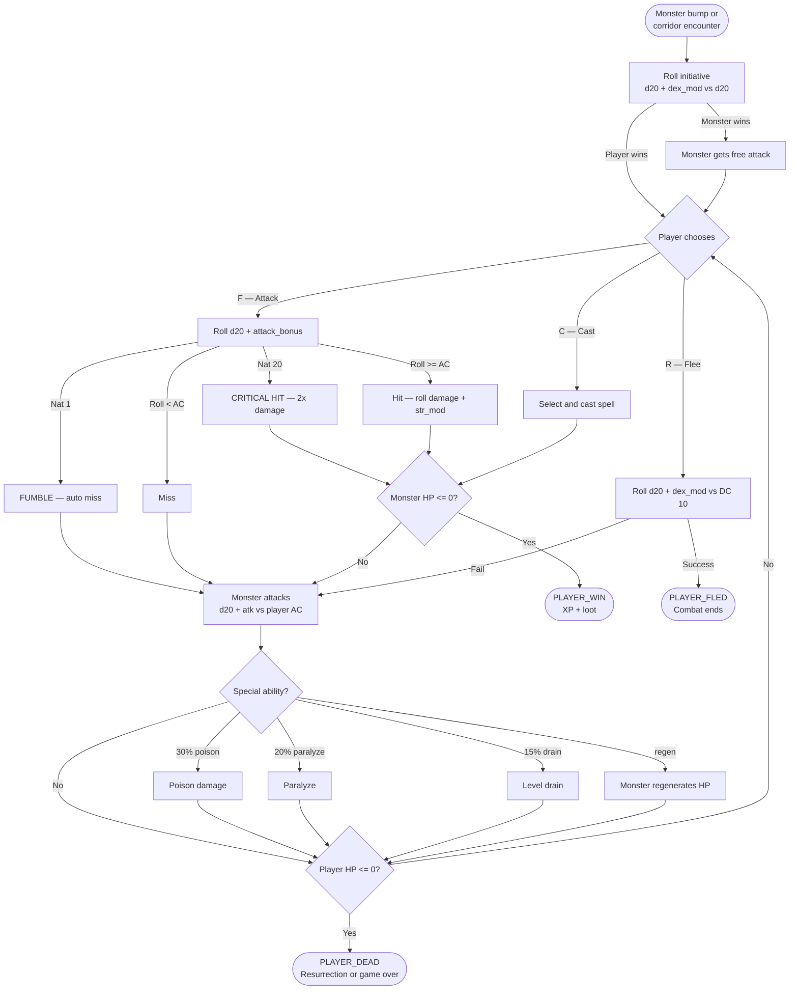
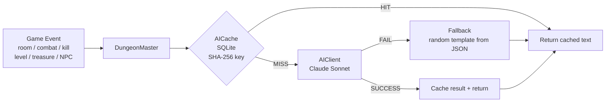
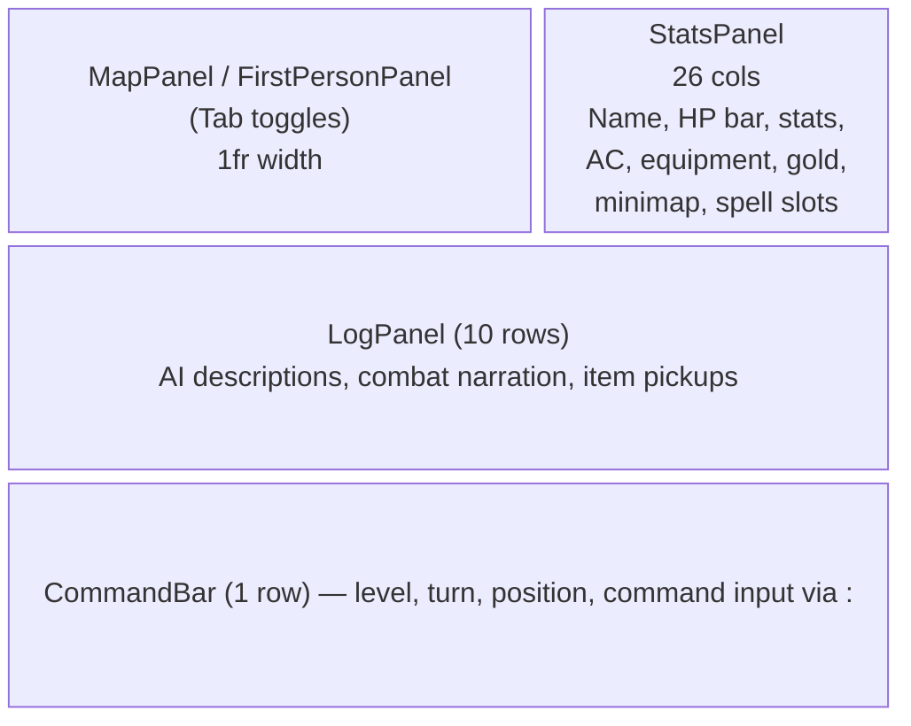
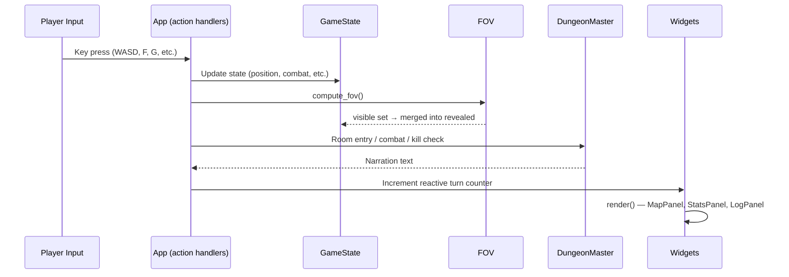
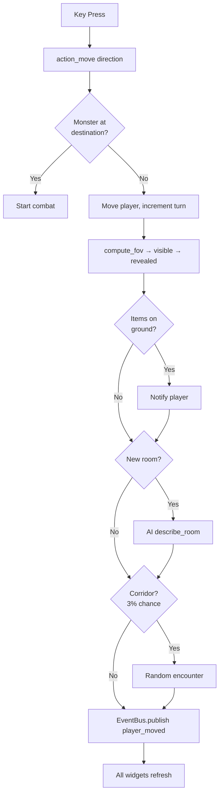
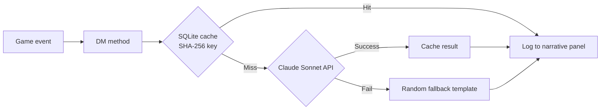

# Architecture

Technical architecture for Dungeons of Dreagoth II.

## System Overview



## Core Modules

### `core/constants.py`
All tuneable game parameters. Grid is 80x40 (expanded from original 80x24). Key values: `ROOMS_PER_LEVEL=25`, `FOV_RADIUS=8`, room sizes 3-8 x 3-6. Dungeon depth is unlimited — monsters and NPCs scale through level 14+.

### `core/events.py`
Synchronous pub/sub event bus. Single global instance `bus`. Components subscribe to named events (strings); publishers call `bus.publish("event_name", **data)`. Current events: `player_moved`.

### `core/game_state.py`
Central state dataclass. Fields:
- `player_x`, `player_y`, `current_depth`, `turn` — position and time
- `player: Character` — the player character with stats, inventory, equipment
- `levels: dict[int, DungeonLevel]` — lazily generated dungeon floors
- `entities: dict[int, LevelEntities]` — monsters and treasure per level
- `revealed`, `visible` — FOV/fog-of-war tile sets
- `visited_rooms` — tracks which rooms have been entered (for AI room descriptions)
- `combat: CombatState | None` — active combat encounter

### `core/dice.py`
Standard D&D dice: `d4` through `d100`, plus `ability_roll()` (4d6 drop lowest).

### `core/save_load.py`
JSON serialization to `saves/` directory. 5 manual slots + autosave (slot 0). Items stored by ID (not value) to keep saves small and auto-apply balance changes. Version field for future migration.

### `core/command_parser.py`
21 commands with aliases and tab completion. Vi-style `:` activates input mode in CommandBar.

## Dungeon Generation

### Tile System (`dungeon/tiles.py`)

Preserves the original 1991 QBasic hex encoding as a Python `IntEnum`:

```
0x00  EMPTY              0x07  STAIRS_UP          0x14  ROOM
0x01  DOOR_NS            0x08  STAIRS_DOWN        0x15  UNSTABLE_WALL
0x02  DOOR_EW            0x09  STAIRS_BOTH        0x20  CORRIDOR
0x05  SECRET_DOOR_NS     0x10  CHARACTERS         0x94  UNCHARTED_ROOM
0x06  SECRET_DOOR_EW     0x11  MONSTERS           0xFF  WALL
                         0x12  TREASURE
                         0x13  SPECIAL
```

Door flags (OR'd): `0x80` = locked, `0x40` = magically locked. Helpers: `is_door()`, `is_locked()`, `is_magically_locked()`, `unlock_door()`, `base_tile()`. Flag-aware `is_walkable()` / `is_transparent()`.

### Grid Storage (`dungeon/dungeon_level.py`)

Each level is an 80x40 `numpy.uint8` array stored as `grid[y, x]` (row-major). The `DungeonLevel` class provides `__getitem__`/`__setitem__` with `(x, y)` interface, `in_bounds()`, and `can_walk()`. Also stores room list and stair positions.

### Generation Algorithm (`dungeon/generator.py`)

Ported from `Old_Code/DUNGEON.TXT` with improvements:



**Key improvement over original:** The 1991 code only connected up/down stairs with a DFS path, leaving most rooms unreachable. MST guarantees full connectivity.

### Corridor Carving (`dungeon/corridor.py`)

L-shaped corridors between two points. Randomly chooses horizontal-then-vertical or vertical-then-horizontal. Carves `CORRIDOR` tiles only through `WALL` cells.

### Field of View (`dungeon/fov.py`)

Recursive 8-octant shadowcasting algorithm (RogueBasin reference). Uses octant coordinate transform multipliers to scan all directions symmetrically.

Key detail: slopes use `dy = -j` (negative depth convention). The algorithm tracks start/end slopes per scan row, recursing when walls create shadow boundaries.

Returns a `set[tuple[int, int]]` of visible positions. The app merges this into a persistent `revealed` set for fog-of-war. Radius extended by Light spell buff.

### Dungeon Populator (`dungeon/populator.py`)

After a level is generated, `populate_level()` fills it with monsters, treasure, and NPCs (1-3 per level):
- Each non-stair room has a 50%+ chance of a monster (scales with depth)
- 30% chance of gold in each room, plus a chance for equipment drops
- Returns a `LevelEntities` dataclass with `monster_at(x, y)` / `npc_at(x, y)` for collision lookup
- Stair rooms are kept empty as safe zones

## Character System

### Character (`character/character.py`)

Core player data and mechanics:

- **4 classes** — Fighter (1d10 HP, +1 atk/level), Mage (1d4 HP, +0.5 atk/level), Thief (1d6 HP), Cleric (1d8 HP). Defined in `CLASS_DATA` dict
- **4 races** — Human (no mods), Elf (+1 DEX/INT, -1 CON), Dwarf (+2 CON, -1 CHA), Halfling (+2 DEX, -1 STR). Defined in `RACE_DATA` dict
- **6 ability scores** — rolled with 4d6-drop-lowest, modified by race
- **AC calculation** — Descending (classic D&D): 10 - dex_mod - equipment ac_bonus - buffs. Lower = better
- **Attack bonus** — level * class multiplier + str_mod + sum of equipment attack_mod + buffs. THAC0-style: d20 + attack_bonus >= 20 - target_AC
- **8 equipment slots** — weapon, armor (body), shield, helmet (head), boots, gloves, ring, amulet. Class restrictions enforced on equip. Slot-to-field mapping in `_SLOT_MAP`
- **Leveling** — 10-level XP table. Level-up adds hit die + CON mod to max HP
- **Spell slots** — 3-level slot progression for Mage and Cleric classes

`create_character(name, class, race)` rolls a complete character with starting gold (3d6 * 10). The `CharacterCreationScreen` modal also assigns starting equipment per class.

### Items and Equipment (`entities/item.py`)

- **`Item` dataclass** — id, name, category, price/currency, damage dice (weapons), AC bonus (armor/accessories), attack_mod (accessories), slot, class restrictions, consumable/heal_dice fields, regen_dice/regen_turns for food heal-over-time
- **`EquipmentDB` singleton** — loads `data/equipment.json` (76 items: weapons, armor, accessories, clothing, provisions, misc, 5 consumable healing items). Provisions (rations, ale) are consumable food with regen buffs. Categories include helmets, boots, gloves, rings, and amulets
- **`parse_dice()` / `roll_dice()`** — parses "2d6+1" format strings and rolls them
- **`random_treasure(tier)`** — generates loot appropriate to dungeon depth
- **`for_merchant_tier()`** — filters items appropriate for NPC shops
- Gold values normalized across currencies (G=gold, S=silver/10, C=copper/100)

## Combat System

### Combat Engine (`combat/combat_engine.py`)

Turn-based D&D-style combat:



**Resurrection:** On death, if the player has gold, resurrection costs `min(100*level, gold//10)`. Equipment is dropped at the death position as a treasure pile. Player respawns at stairs_up with half HP. 0 gold = permanent death.

**`CombatState`** tracks the full fight: player, monster, round counter, result enum, and a combat log of styled text entries.

**`CombatResult`** enum: `ONGOING`, `PLAYER_WIN`, `PLAYER_FLED`, `PLAYER_DEAD`.

### Monsters (`entities/monster.py`)

- **`MonsterTemplate`** — static stats from `data/monsters.json`
- **`Monster`** — live instance with HP, position, damage. Created via `MonsterDB.spawn()`
- **22 types** scaling across levels 1-14:

| Monster | Levels | HP | AC | Damage | Special | XP |
|---------|--------|-----|-----|--------|---------|-----|
| Giant Rat | 1-3 | 1d4 | 7 | 1d3 | — | 5 |
| Giant Bat | 1-3 | 1d4 | 8 | 1d2 | — | 5 |
| Kobold | 1-4 | 1d4 | 7 | 1d4 | — | 7 |
| Goblin | 1-5 | 1d6 | 6 | 1d6 | — | 10 |
| Skeleton | 2-6 | 1d8 | 7 | 1d6 | undead | 15 |
| Zombie | 2-6 | 2d8 | 8 | 1d8 | undead | 20 |
| Orc | 2-7 | 1d8 | 6 | 1d8 | — | 25 |
| Giant Spider | 3-7 | 2d8 | 6 | 1d6 | poison | 30 |
| Hobgoblin | 3-8 | 1d8+1 | 5 | 1d8 | — | 35 |
| Ghoul | 4-8 | 2d8 | 6 | 1d6+1 | paralyze | 50 |
| Ogre | 4-10 | 4d8 | 5 | 1d10 | — | 75 |
| Wight | 5-11 | 4d8 | 5 | 1d8 | drain | 100 |
| Troll | 6-12 | 6d8 | 4 | 2d6 | regen | 150 |
| Minotaur | 7-12 | 6d8 | 4 | 2d6+2 | charge | 200 |
| Gargoyle | 8-13 | 4d8+4 | 3 | 2d6 | — | 200 |
| Wraith | 8-14 | 5d8 | 3 | 1d8+2 | drain | 250 |
| Owlbear | 9-13 | 5d8+5 | 4 | 2d6+1 | — | 225 |
| Basilisk | 9-14 | 6d8 | 3 | 2d6 | paralyze | 300 |
| Vampire | 10-14 | 8d8 | 2 | 2d6+2 | drain | 500 |
| Hill Giant | 10-14 | 8d8 | 3 | 2d8 | — | 400 |
| Spectre | 11-14 | 7d8 | 2 | 2d6 | drain | 450 |
| Young Black Dragon | 12-14 | 10d8 | 1 | 3d6 | poison | 750 |

Each monster has a unique single-character symbol and color for the map display.

### Spells (`combat/spells.py`)

- **`SpellDB` singleton** — loads `data/spells.json` (12 spells: 6 mage, 6 cleric)
- **`SpellSlots`** — 3-level slot progression, restored on stair rest
- **`ActiveBuff`** — time-limited combat/utility buffs (e.g., Light extends FOV radius). Also used for food regen: `effect="regen"` with `regen_dice` rolled each turn via `tick_buffs()`
- `player_cast()` handles spell combat integration

## NPCs and Quests

### NPCs (`entities/npc.py`)

- **`NPCDB` singleton** — loads `data/npcs.json` (11 templates: 4 merchants, 2 quest givers, 2 sages, 3 wanderers)
- **`NPC`** — tracks position, `talked_to`, `quest_id`
- AI DM generates dialogue; fallback templates for offline play

### Merchants

OptionList-based merchant screen for buying/selling. Items filtered by `for_merchant_tier()` based on dungeon depth.

### Quests (`quest/quest.py`)

- **`QuestType`** — `KILL_MONSTERS`, `EXPLORE_DEPTH`
- **`QuestLog`** — progress tracking with completion checks
- `generate_quest()` creates depth-appropriate random quests
- AI DM narrates quest offers and completions

## AI Dungeon Master

### Design Principles
1. **AI is narration-only** — never affects combat math, movement, or dice
2. **Cache-first** — SQLite prevents duplicate API calls for the same content
3. **Always falls back** — game is 100% playable without an API key

### Architecture



### Prefetch

`_prefetched_depths` set prevents redundant API calls on revisited levels. When descending, prefetch blocks movement with a loading notice until complete.

### Modules

**`ai/client.py`** — Wraps Anthropic SDK. Reads API key from `claude.key.txt` (project root) or `ANTHROPIC_API_KEY` env var. Tracks input/output tokens for cost estimation. Uses Claude Sonnet for speed and cost.

**`ai/cache.py`** — SQLite database at `saves/ai_cache.db`. Keys are `"{content_type}:{sha256_hash}"`. Content types: `room_enter`, `combat_start`, `combat_kill`, `combat_crit`, `level_theme`, `treasure_find`.

**`ai/fallback.py`** — Loads `data/fallback_descriptions.json` and returns random entries per category. Lazy-loaded on first call.

**`ai/dm.py`** — `DungeonMaster` singleton orchestrates all AI narration:
- `describe_room()` — triggered on first visit to each room
- `narrate_combat_start()` — when bumping into a monster
- `narrate_kill()` — on monster death (includes weapon name)
- `narrate_crit()` — on critical hits
- `describe_level_theme()` — when descending to a new level
- `describe_treasure()` — when picking up loot
- NPC dialogue — AI-generated conversation with personality

All methods share the same system prompt establishing tone (dark fantasy, second person, 1-3 sentences, no emojis).

## Audio System

### Sound Manager (`audio/sound_manager.py`)

Event-driven singleton connected via the event bus. Fallback chain: playsound3 → winsound → aplay → bell → silent.

- **playsound3** — cross-platform, optional pip extra `[audio]`
- **winsound** — Windows built-in, non-blocking via `SND_ASYNC`
- **aplay** — ALSA utils, available on nearly all Linux systems with no pip dependencies
- **bell** — terminal bell (`\a`), last-resort audible fallback
- **silent** — no audio output

**`audio/tone_generator.py`** — creates 19 retro WAV files using stdlib only. Config in `data/sounds.json` (21 event-to-sound mappings). Optional `[audio]` pip extra for playsound3.

## UI Architecture

Built on [Textual](https://textual.textualize.io/), a Python TUI framework built on Rich.

### Layout



### Rendering Pipeline



### Widget Communication

Widgets hold a reference to `GameState` (set via `set_game_state()`). The app calls `refresh_map()`/`refresh_stats()`/`refresh_bar()` which increment reactive counters to trigger re-renders. Log messages go through `RichLog.write()`.

### Modal Screens

- **`CharacterCreationScreen`** — Name, class, race selection. Starting equipment per class. Load Game button for returning players
- **`SpellSelectionScreen`** — Choose spell to cast from available slots
- **`SaveLoadScreen`** — 5 manual slots + autosave
- **`MerchantScreen`** — OptionList-based buy/sell interface
- **`InventoryScreen`** — OptionList-based equip/unequip/use
- **`UseItemScreen`** — Consumable item selection
- **`QuitScreen`** — Quit confirmation with Save & Quit, Quit Without Saving, and Cancel options

### Key Bindings

| Key | Action | Context |
|-----|--------|---------|
| W/S/A/D, Arrows | Move / Turn | Exploration |
| F | Attack | Combat |
| R | Flee | Combat |
| C | Cast spell | Combat (Mage/Cleric) |
| G | Pick up items | On treasure tile |
| I | Show inventory | Any time |
| U | Use consumable | Any time |
| T | Talk to NPC | Adjacent to NPC |
| J | Quest log | Any time |
| V | Toggle map/first-person | Any time |
| < (comma) | Ascend stairs (heals) | On up stairs |
| > (period) | Descend stairs (heals) | On down stairs |
| Ctrl+S | Save game | Any time |
| Ctrl+L | Load game | Any time |
| : | Command input mode | Any time |
| Q | Quit (confirmation modal: Save & Quit / Quit / Cancel) | Any time |

## Data Flow

### Exploration



### AI Narration


